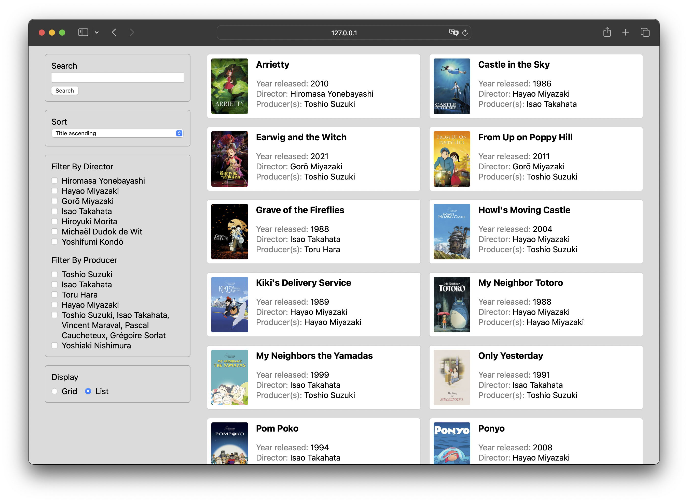

# TP1

Pondération : 30 % \
Énoncé : Cours 6 \
Remise : Cours 10

## Description

Fondée en 1990, [IMDb](https://www.imdb.com) (_Internet Movie Database_) est une base de données en ligne sur le cinéma et la télévision. Le site Web contient un grand nombre d'informations sur les acteurs·rices, les réalisateur·rices, les scénaristes, et toutes autres personnes ou organisations intervenant dans l'élaboration d'un film ou d'une série télévisée.

Pour ce premier travail pratique, vous travaillerez à la création de votre propre base de données en ligne sur le sujet de votre choix. À partir d'un jeu de données disponibles en libre accès, vous mettrez sur pied un site Web qui affiche des informations à ce sujet, et permet aux utilisateur·rices de trier, filtrer et effectuer des recherches parmi le contenu qui s'y trouve.

## Fonctionnalités requises

### Afficher

-   Le site Web doit afficher dynamiquement les informations les plus importantes des valeurs du jeu de données (minimum 5).
-   L'interface du site Web doit donner le choix entre un affichage en grille ou en liste. Certaines informations peuvent s'afficher seulement dans une vue ou dans l'autre, en autant qu'il y ait 5 informations au total (incluant les images).

#### Ressources

-   [document.createElement()](https://developer.mozilla.org/fr/docs/Web/API/Document/createElement)
-   [Element.replaceChildren()](https://developer.mozilla.org/en-US/docs/Web/API/Element/replaceChildren)
-   [Element.innerHTML](https://developer.mozilla.org/fr/docs/Web/API/Element/innerHTML)

### Trier

-   L'interface doit permettre aux utilisateur·rices de trier les données du site Web selon au moins 2 propriétés (une à la fois).
-   Le tri doit pouvoir se faire en ordre ascendant ou descendant. Il devrait donc y avoir 4 choix au total : propriété #1 ascendant, propriété #1 descendant, propriété #2 ascendant, et propriété #2 descendant.
-   Le tri doit être intelligent, c'est-à-dire prendre en compte le type de données et la pertinence de la propriété. Par exemple, doit-on pouvoir classer des lieux en fonction des codes postaux ? Est-ce que les majuscules et les minuscules sont importantes ? Vérifiez vos tris, surtout en présence de valeurs numériques.

#### Ressources

-   [switch](https://developer.mozilla.org/fr/docs/Web/JavaScript/Reference/Statements/switch)
-   [Array.prototype.sort()](https://developer.mozilla.org/fr/docs/Web/JavaScript/Reference/Global_Objects/Array/sort)
-   [String.prototype.localeCompare()](https://developer.mozilla.org/fr/docs/Web/JavaScript/Reference/Global_Objects/String/localeCompare)

### Filtrer

-   L'utilisateur·e doit pouvoir appliquer un filtre sur l'ensemble des données.
-   Les options du filtre doivent être tirées de 2 propriétés.
-   Les options doivent être dynamique, c'est-à-dire générées à partir des données du jeu, et non codées manuellement.
-   Il doit y avoir un retour visuel qui affiche la valeur du filtre présentement appliqué.
-   L'utilisateur·e doit pouvoir enlever les filtres sans avoir à recharger la page.

#### Ressources

-   [Array.prototype.includes()](https://developer.mozilla.org/fr/docs/Web/JavaScript/Reference/Global_Objects/Array/includes)
-   [Array.prototype.push()](https://developer.mozilla.org/fr/docs/Web/JavaScript/Reference/Global_Objects/Array/push)
-   [Element.setAttribute()](https://developer.mozilla.org/fr/docs/Web/API/Element/setAttribute)
-   [Array.prototype.filter()](https://developer.mozilla.org/fr/docs/Web/JavaScript/Reference/Global_Objects/Array/filter)
-   [Object.values()](https://developer.mozilla.org/fr/docs/Web/JavaScript/Reference/Global_Objects/Object/values)
-   [Array.prototype.every()](https://developer.mozilla.org/fr/docs/Web/JavaScript/Reference/Global_Objects/Array/every)

### Rechercher

-   Il doit être possible d'effectuer des recherches dans les données.
-   La recherche doit s'effectuer sur au moins 2 propriétés et être flexible, c'est-à-dire ignorer la casse, ne pas être restreinte aux débuts d'une chaîne, et s'appliquer à plusieurs types de données (nombre, chaîne, date, etc.).
-   Les champs de recherche possibles doivent être pertinents selon le sujet.
-   Il faut prévoir une manière d'annuler ou de cesser la recherche, et ré-afficher toutes les données.

#### Ressources

-   [Array.prototype.filter()](https://developer.mozilla.org/fr/docs/Web/JavaScript/Reference/Global_Objects/Array/filter)
-   [String.prototype.toLowerCase()](https://developer.mozilla.org/fr/docs/Web/JavaScript/Reference/Global_Objects/String/toLowerCase)

## Jeu de données

Vous êtes libre de choisir votre propre jeu de données, à condition que celui-ci respectent certains critères :

-   Le jeu de donnée doit être en format JSON.
-   Il doit contenir au moins 10 valeurs, chacune ayant au moins 5 propriétés.
-   L'accès au jeu de données ne doit pas nécessiter d'authentification.
-   Le jeu de donnée doit permettre le partage des ressources entre origines multiples (CORS).
-   Puisque le même jeu de données sera utilisé pour le TP2, celui-ci doit être disponible en ligne via une requête `fetch()`. Autrement dit, les données JSON doivent être accessibles directement depuis un URL. Par exemple : https://fakestoreapi.com/products.

Vous trouverez un répertoire de jeux de données disponibles en libre accès à l'adresse suivante : https://github.com/public-apis/public-apis. Assurez-vous que le jeu de données que vous choisissez respecte les critères ci-haut.

### Exemples

-   [Livres](https://openlibrary.org/developers/api)
-   [Wizarding World](https://wizard-world-api.herokuapp.com/swagger/index.html)
-   [Personnages d'Harry Potter](https://hp-api.onrender.com)
-   [Fruits](https://www.fruityvice.com/#1)
-   [Brasseries](https://www.openbrewerydb.org)
-   [Donjon et dragon](https://www.dnd5eapi.co/docs/)
-   [Jeux gratuits](https://www.freetogame.com/api-doc)
-   [Personnages de Disney](https://disneyapi.dev)
-   [Compendium de Hyrule](https://gadhagod.github.io/Hyrule-Compendium-API/#/)
-   [Legend of Zelda](https://docs.zelda.fanapis.com/docs)
-   [Pokemon](https://pokeapi.co)
-   [Pays du monde](https://restcountries.com/#endpoints-all)
-   [Lancements de fusées Space X](https://github.com/r-spacex/SpaceX-API)
-   [Vélos de ville](https://api.citybik.es/v2/)
-   [Faux site marchand](https://fakestoreapi.com/docs)
-   [Star Wars](https://swapi.dev/documentation)
-   [The Metropolitan Museum of Art](https://metmuseum.github.io/)
-   [Art Institute of Chicago](https://api.artic.edu/docs/#introduction)

## Remise

La remise du TP se fera à travers GitHub Classroom. Il vous faut d'abord accepter le travail à l'adresse suivante : https://classroom.github.com/a/0Gf5o64r. Une fois le travail accepté, vous devez cloner (et non télécharger) le dépôt sur votre poste de travail. Pour remettre votre TP, vous n'avez qu'a pousser les changements vers le dépôt distant GitHub.

## Critères d'évaluation

### Organisation du code et des fichiers `5`

-   Les fichiers sont bien identifiés et organisés selon leur type.
-   Le code utilise pertinemment les modules Javascript (une classe par module, fichier `main.js`, etc.).

### Respect des consignes `10`

-   Les consignes liées aux fonctionnalités sont respectées.

### Qualité et lisibilité du code `15`

-   Le code est lisible ; il est écrit et commenté de sorte à ce qu'un ou une nouvelle développeuse puisse bien le comprendre.
-   Il est clair au premier coup d'œil quelle partie du code correspond à quelle fonctionnalité (afficher, vues, trier, filtrer, rechercher).
-   Les classes, constructeurs et méthodes sont documentés avec [JSDoc](https://jsdoc.app/index.html). (Seule la description est obligatoire ; la documentation des paramètres et de la valeur de retour est facultative.)
-   L'indentation du code est respectée et le style du code est constant (astuce : utilisez [Prettier.js](https://prettier.io)).
-   Les algorithmes sont de bonnes qualité.
-   Le code respecte les principes de la programmation orientée object.
-   Le code est DRY ; il y peu ou pas de répétitions inutiles.
-   Les bonnes balises HTML sont utilisées correctement (astuce : validez votre code avec le [validateur du W3C](https://validator.w3.org/#validate_by_input)).
